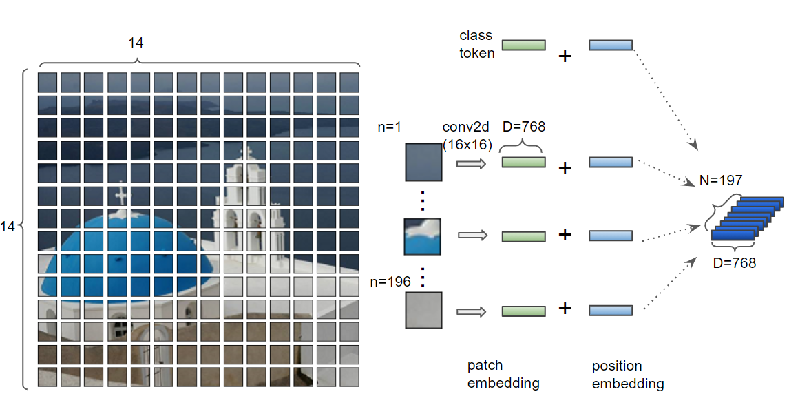
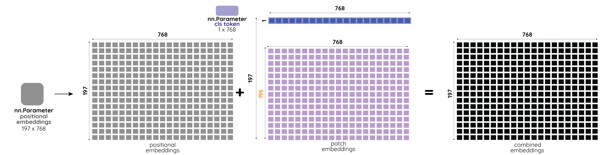
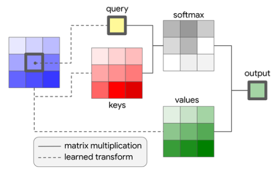
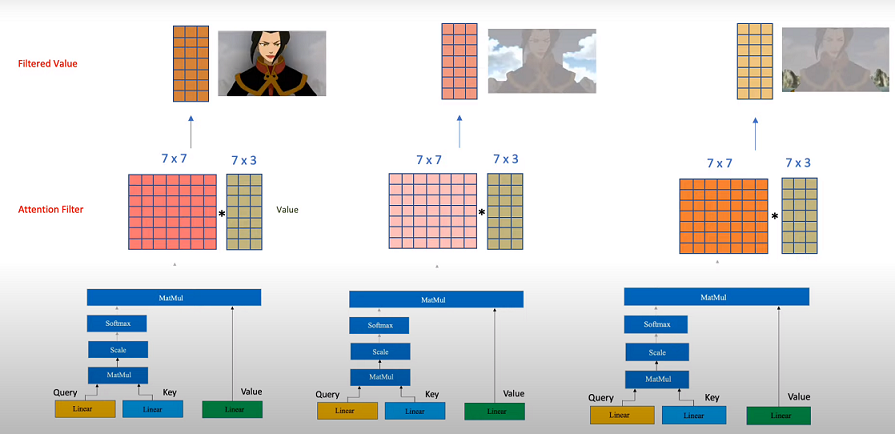
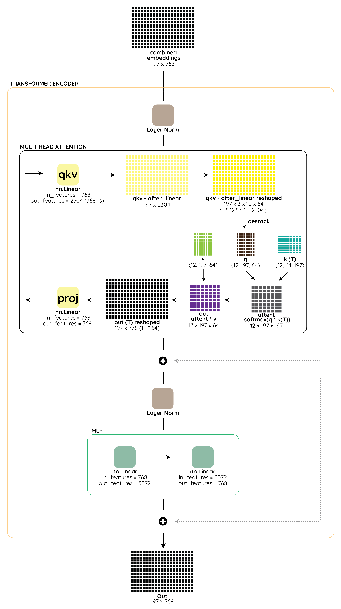

  

Source:
 <a href="https://ai.googleblog.com/2020/12/transformers-for-image-recognition-at.html" target="_blank">Google AI Blog</a>

### EMBEDDINGS:

This class as name implies, is used to convert the image from to embeddings, which are 1D vectors, used in transformers. 

  

The images converted to embeddings are of two parts, one which is the *patch_embedding* which is the conversion of the image itself to a vector, and another is *positional_embedding* where a learnable vector of same size as patch_embedding is created and added to patch_embedding.

* The Image is first used to find the number of patches and size of each patch using the *grid*/*size* parameter from the config.
* If <u>*hybrid* mode is selected</u> than the Image is sent through the a ResNet model, to convolve the image and get a better represented image with higher channels.
* The Image(convolved Image if hybrid=True) is than sent through a Conv2d layer, with the Kernel size as *path_size*, and *hidden_size* as the number of kernels, to convert the images to 1D Vectors each of size hidden_size, and the total number of such vectors will be *n_patches*. The reason to use Conv2d instead of a fully connected layer for each patch, is performance gain using Convolutions.
* The output from the Conv2d is flattened to create the embeddings, which is of dimension *n_patch* x *hidden_size*  and a *cls_token* which is a learnable vector of size 1x*hidden_size* is concatenated to the embedding.
* This final *patch_embedding* is than added with another embedding, which is dimension 196 x 768, where all are learnable parameters and are termed as *positional_embeddings* and the idea is these parameters would be capable of learning the positional characteristics of the patches
* A final drop out is applied to these final embeddings, before returning them.

Another perspective on how the embeddings are derived

  

### ATTENTION:

***Attention is ALL you NEED***

This class is the core of transformers, where the image embeddings are the input to the model(class), and it performs the self-attention mechanism.

In brief the self-attention mechanism, is a dynamic way to attend to each part of the sequence for every position in the sequence. In simple words, a sequence of length E, gives rise to an attention map of ExE, which is formed by forming attention for each position of E with all the other positions including itself, so we get E attention for each position and hence in total ExE map of attentions.

  

Source: 
 <a href="https://www.louisbouchard.ai/will-transformers-replace-cnns-for-vision/" target="_blank">Louis Bouchard</a>

Each Patch attends to every other patch, and the results are passed though a softmax and multiplied with value embeddings as shown below:

  

Source: 
 <a href="https://towardsdatascience.com/self-attention-in-computer-vision-2782727021f6" target="_blank">Towards Data Science</a>

Here the result is shown for only patch, we perform this operation for every patch in *query*(blue) and get 3x3 output.

**Multi-Head Attention** -  This is akin to channels in the Convolutional Neural Networks, where the embeddings of size E, is split into d parts, each of size E/d. And the Attention is performed in parallel between the d attention heads, where key, query and value have N x E/d embeddings.

*  The Attention class takes the *hidden_state* which are the embeddings from the Image coming out of the Embeddings class.
* The *hidden_state* is passed through 3 separate Linear layers, which converts the *hidden_state* to ***key***, ***value*** and ***query***. 
* All the three are split by *config['num_head']* for Multi-Head Attention.
* The ***key*** and ***query*** are multiplies(*matmul*), to get the attention scores. These attention scores can be thought as the weights/attention/focus of each patch/embedding with all the other patches in the image.
* The attention scores are passed through the *softmax* layer to get the probability distribution, It has been empirically found out that, it's better to divide by  to the attention scores before sending to softmax, since huge values in softmax get separated even more.
* If any attention dropout is given, it is applied, and than the ***values*** embedding is multiplied(matmul) with attention scores, this can be thought of as weighted average of the value embeddings based on the attention/focus of each patch with all other patches.
* Finally the multi-ahead attention based heads are combined, and a projection layer (Linear) is applied.

  

Source: 
 <a href="https://www.youtube.com/watch?v=mMa2PmYJlCo" target="_blank">Hedu - Math of Intelligence</a>

The Multi-Head Attention, can be though as Channels in Convolutions, here each attention head is responsible for filtering out pixels which are related to each other, in the example showed above, the first head focus on the person, where as the second head is focusing on the clouds in the background and similarly the third head is focus on the small mountains in the bottom.

### MLP:

The Multi-Layer Perceptron(MLP) class here is a series of fully connected layers with activation layer and regularization in between each layer.

In this implementation, we have 2 Linear Layers (Fully Connected Layers). 

The first takes the input neurons which is the *hidden_size* (in ViT 768), coming from Multi-Head Attention and map it to *mlp_dim*(from config file) number of neurons which is generally 4 times the *hidden_size* and than applies the non linearity, which in case of ViT is the GeLU.

Then it is passed through a drop out layer which acts as regularization and tries to improve the generalization. Then the neurons are again down scaled back to *hidden_size* from *mlp_dim* and is passed to final drop out layer.

The weights initialization for the Linear layer is done through Xavier Uniform.

Xavier and Yoshua in their paper titled [*Understanding the difficulty of training deep feedforward neural networks*](http://proceedings.mlr.press/v9/glorot10a/glorot10a.pdf) showed that initializing the weights from a uniform distribution in [-1,1] range doesn't work that well.

So they came up with an approach where the chose values from a random uniform distribution that's bounded between  

And the bias for the linear layer is initialized using the normal distribution.

### BLOCK:

The Block class is the aggregate class which performs the *single encoder block* of the transformer

It takes the *combined embeddings*(197 x 768), creates a copy for further down skip connection, passes though a layer Norm, and the *Multi-Head Attention* discussed above is performed on the combined embeddings, and than the previously saved combined embeddings is added to the result of Multi-Head attention, a copy is saved for another skip connection, and 2nd Layer Norm is applied.

The resultant normalized embedding is than passed thorough the *MLP* block which projects the embeddings to higher dimension and passed through anon-linearity and brings back to same dimension as before (197 x 768).

Finally the 2nd combined embeddings which was saved after Multi-Head attention is added as a skip connection to the output of MLP.

The input to this block for first is the input image embeddings, and for further blocks, the output of previous block is sent to next block.

The ***Block***  also has a *load_from* method, which is used to load the weights of the model if any given the path of the weights file.

### ENCODER:

This the major class for the Transformer, where the entire Visual Transformer pack takes place.

The *encoder* used the above *Block* class, and repeats for *num_layers* times, which is nothing but repeating the encoding block multiple times, This repetition can range from 12 to 32 times.

The *blocks* are repeated and are appended to *nn.ModuleList* which can be used to loop through in the forward method.

Finally a Layer Norm is applied to the output of the Encoder, to get the encoded representation of the input.

The input to this ***Encoder*** will be the Image Embeddings converted by adding the positional embedding.

